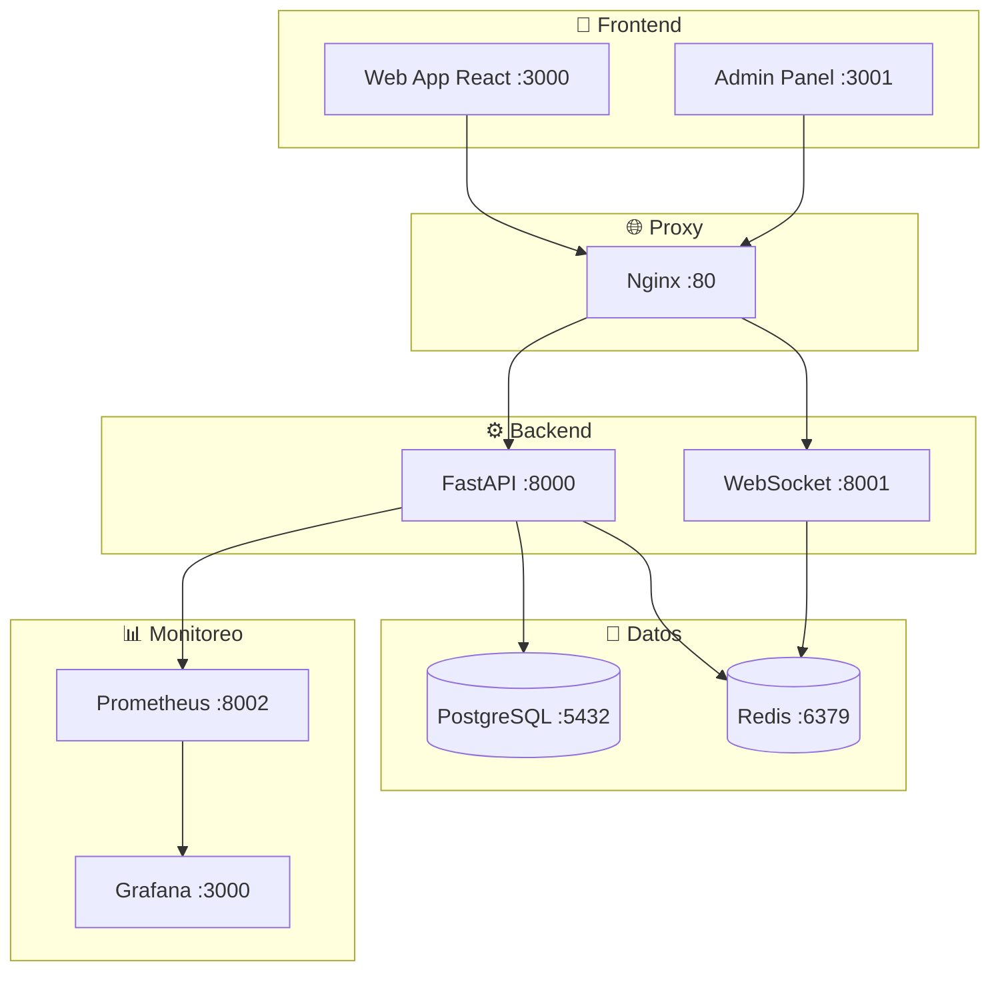

# 🚀 ML API FastAPI v2

**API completa para Machine Learning con FastAPI, React y monitoreo en tiempo real**

## 📋 Tabla de Contenidos

- [🎯 Descripción](#-descripción)
- [🏗️ Arquitectura](#️-arquitectura)
- [🌐 Puertos y Servicios](#-puertos-y-servicios)
- [⚡ Inicio Rápido](#-inicio-rápido)
- [🔧 Configuración Manual](#-configuración-manual)
- [📖 Documentación API](#-documentación-api)
- [🎨 Frontend](#-frontend)
- [📊 Monitoreo](#-monitoreo)
- [🚀 Despliegue](#-despliegue)
- [🧪 Testing](#-testing)
- [🤝 Contribución](#-contribución)

## 🎯 Descripción

ML API FastAPI v2 es una plataforma completa para desarrollar, desplegar y monitorear modelos de Machine Learning. Incluye:

- **Backend FastAPI** con endpoints REST para predicciones
- **Frontend React** para gestionar modelos y visualizar resultados
- **WebSockets** para actualizaciones en tiempo real
- **Cache Redis** para optimizar rendimiento
- **Base de datos PostgreSQL** para persistencia
- **Monitoreo completo** con Prometheus y Grafana
- **Panel de administración** para gestión avanzada

## 🏗️ Arquitectura



## 🌐 Puertos y Servicios

| Servicio           | Puerto | URL                   | Descripción                |
| ------------------ | ------ | --------------------- | -------------------------- |
| **Frontend Web**   | 3000   | http://localhost:3000 | 🎨 App principal React/Vue |
| **Frontend Admin** | 3001   | http://localhost:3001 | 🔧 Panel administración    |
| **Backend API**    | 8000   | http://localhost:8000 | ⚙️ FastAPI REST API        |
| **WebSocket**      | 8001   | ws://localhost:8001   | 📡 Tiempo real             |
| **Metrics**        | 8002   | http://localhost:8002 | 📊 Prometheus metrics      |
| **Grafana**        | 3000   | http://localhost:3000 | 📈 Dashboards              |
| **PostgreSQL**     | 5432   | localhost:5432        | 🗄️ Base de datos           |
| **Redis**          | 6379   | localhost:6379        | ⚡ Cache                   |
| **Nginx**          | 80     | http://localhost      | 🌐 Proxy reverso           |

## ⚡ Inicio Rápido

### 1️⃣ Configuración Automática

```bash
# Clonar repositorio
git clone <repository-url>
cd ml-api-fastapi-v2

# Ejecutar script de configuración
chmod +x infrastructure/scripts/setup.sh
./infrastructure/scripts/setup.sh
```

### 2️⃣ Con Docker (Recomendado)

```bash
# Levantar todos los servicios
docker-compose up -d

# Ver logs
docker-compose logs -f

# Parar servicios
docker-compose down
```

### 3️⃣ Verificar Servicios

```bash
# Health check
curl http://localhost:8000/health

# API docs
open http://localhost:8000/docs

# Frontend
open http://localhost:3000
```

## 🔧 Configuración Manual

### Backend (Python + FastAPI)

```bash
# 1. Crear ambiente virtual
cd backend
python3 -m venv venv

# 2. Activar ambiente virtual
# Linux/Mac:
source venv/bin/activate
# Windows:
venv\Scripts\activate

# 3. Instalar dependencias
pip install -r requirements/base.txt

# 4. Configurar variables de entorno
cp config/local.env .env

# 5. Ejecutar migraciones
alembic upgrade head

# 6. Ejecutar servidor
uvicorn app.main:app --reload --host 0.0.0.0 --port 8000
```

### Frontend (React + Vite)

```bash
# 1. Web App
cd frontend/web-app
npm install
npm run dev

# 2. Admin Panel
cd frontend/admin-panel
npm install
npm run dev
```

### Base de Datos

```bash
# PostgreSQL con Docker
docker run -d \
  --name ml-api-postgres \
  -e POSTGRES_USER=postgres \
  -e POSTGRES_PASSWORD=postgres \
  -e POSTGRES_DB=ml_api_db \
  -p 5432:5432 \
  postgres:16-alpine

# Redis con Docker
docker run -d \
  --name ml-api-redis \
  -p 6379:6379 \
  redis:7-alpine
```

## 📖 Documentación API

### Endpoints Principales

#### 🏥 Health Check

```http
GET /health              # Health básico
GET /health/detailed     # Health detallado
GET /health/liveness     # Kubernetes liveness
GET /health/readiness    # Kubernetes readiness
```

#### 🎯 Predicciones

```http
POST /api/v1/predict/           # Crear predicción
GET  /api/v1/predict/{id}       # Obtener predicción
GET  /api/v1/predict/           # Listar predicciones
DELETE /api/v1/predict/{id}     # Eliminar predicción
POST /api/v1/predict/batch      # Predicciones en lote
```

#### 📦 Modelos

```http
GET    /api/v1/models/          # Listar modelos
POST   /api/v1/models/          # Crear modelo
GET    /api/v1/models/{id}      # Obtener modelo
PUT    /api/v1/models/{id}      # Actualizar modelo
DELETE /api/v1/models/{id}      # Eliminar modelo
```

#### 📤 Upload

```http
POST /api/v1/upload/            # Subir archivo
POST /api/v1/upload/model       # Subir modelo ML
```

#### 📡 WebSocket

```
ws://localhost:8001/ws          # Conexión WebSocket
```

### Ejemplo de Uso

```python
import requests

# 1. Health check
response = requests.get("http://localhost:8000/health")
print(response.json())

# 2. Crear predicción
prediction_data = {
    "model_id": "sklearn-model-1",
    "input_data": {
        "feature1": 1.5,
        "feature2": 2.3,
        "feature3": 0.8
    },
    "async_mode": False
}

response = requests.post(
    "http://localhost:8000/api/v1/predict/",
    json=prediction_data
)
print(response.json())
```

## 🎨 Frontend

### Web App (Puerto 3000)

- **Home**: Dashboard principal con métricas
- **Predict**: Formulario para hacer predicciones
- **Models**: Gestión de modelos ML
- **Upload**: Subir archivos y modelos
- **Results**: Visualización de resultados

### Admin Panel (Puerto 3001)

- **Dashboard**: Métricas del sistema
- **Users**: Gestión de usuarios
- **Models**: CRUD avanzado de modelos
- **System**: Configuración del sistema
- **Logs**: Visualización de logs

### Tecnologías Frontend

- **React 18** con TypeScript
- **Vite** para build y desarrollo
- **TailwindCSS** para estilos
- **React Query** para estado servidor
- **Zustand** para estado local
- **React Hook Form** para formularios
- **Recharts** para gráficos

## 📊 Monitoreo

### Prometheus (Puerto 8002)

- Métricas de aplicación
- Métricas de sistema
- Alertas personalizadas

### Grafana (Puerto 3000)

- Dashboards predefinidos
- Visualización en tiempo real
- Alertas por email/Slack

### Métricas Disponibles

- Número de predicciones
- Tiempo de respuesta
- Uso de CPU y memoria
- Estado de servicios
- Cache hit/miss ratio

## 🚀 Despliegue

### Docker Compose Producción

```bash
# Archivo: docker-compose.prod.yml
docker-compose -f docker-compose.prod.yml up -d
```

### Kubernetes

```bash
# Aplicar manifiestos
kubectl apply -f infrastructure/k8s/
```

### Variables de Entorno Producción

```bash
# Copiar ejemplo
cp config/.env.example config/production.env

# Editar variables críticas
# - SECRET_KEY: Generar clave segura
# - POSTGRES_PASSWORD: Contraseña fuerte
# - REDIS_PASSWORD: Contraseña Redis
# - DEBUG: false
```

## 🧪 Testing

### Backend Tests

```bash
cd backend

# Ejecutar tests
pytest

# Con coverage
pytest --cov=app tests/

# Tests específicos
pytest tests/test_predict.py -v
```

### Frontend Tests

```bash
cd frontend/web-app

# Ejecutar tests
npm test

# Con coverage
npm run test:coverage

# E2E tests
npm run test:e2e
```

### Tests de Integración

```bash
# Docker test environment
docker-compose -f docker-compose.test.yml up -d

# Ejecutar tests de integración
python -m pytest tests/integration/
```

## 🔒 Seguridad

### Autenticación

- JWT tokens
- Refresh tokens
- Role-based access

### Validación

- Input validation con Pydantic
- File upload restrictions
- Rate limiting

### Configuración Segura

- HTTPS en producción
- CORS configurado
- Headers de seguridad

## 🤝 Contribución

### Desarrollo

```bash
# 1. Fork del repositorio
# 2. Crear rama feature
git checkout -b feature/nueva-funcionalidad

# 3. Configurar pre-commit hooks (automático)
chmod +x infrastructure/scripts/setup-precommit.sh
./infrastructure/scripts/setup-precommit.sh

# 4. Hacer cambios y commit
git commit -m "feat: agregar nueva funcionalidad"

# 5. Push y crear PR
git push origin feature/nueva-funcionalidad
```

### Pre-commit Hooks

El proyecto incluye **hooks de pre-commit** para mantener la calidad del código:

```bash
# Configuración automática
./infrastructure/scripts/setup-precommit.sh

# Ejecución manual
pre-commit run --all-files

# Actualizar hooks
pre-commit autoupdate

# Saltarse hooks temporalmente
git commit --no-verify
```

#### 🔧 Hooks Configurados

| Categoría            | Herramientas                              | Propósito                           |
| -------------------- | ----------------------------------------- | ----------------------------------- |
| **🐍 Python**        | Black, isort, Flake8, MyPy, Bandit        | Formateo, linting, tipos, seguridad |
| **🌐 JavaScript**    | ESLint, Prettier                          | Linting y formateo                  |
| **🐳 Docker**        | Hadolint                                  | Linting de Dockerfiles              |
| **📝 Documentación** | Markdownlint                              | Formato de Markdown                 |
| **🔍 General**       | YAML/JSON validation, trailing whitespace | Calidad general                     |
| **🧪 Tests**         | Pytest (tests rápidos)                    | Verificación de funcionalidad       |
| **⚙️ Personalizado** | Docstrings, env vars, package.json        | Verificaciones específicas          |

### Estándares de Código

- **Python**: Black, isort, flake8
- **TypeScript**: ESLint, Prettier
- **Commits**: Conventional commits
- **Documentación**: Docstrings y comentarios

## 📚 Recursos Adicionales

- [📖 Documentación API](http://localhost:8000/docs)
- [📊 Grafana Dashboards](http://localhost:3000)
- [🔧 Admin Panel](http://localhost:3001)
- [📈 Métricas](http://localhost:8002)

## 📄 Licencia

MIT License - ver [LICENSE](LICENSE) para detalles.

## 🆘 Soporte

- **Issues**: [GitHub Issues](https://github.com/tu-usuario/ml-api-fastapi-v2/issues)
- **Documentación**: Ver `/docs` en cada servicio
- **Wiki**: [GitHub Wiki](https://github.com/tu-usuario/ml-api-fastapi-v2/wiki)

---

⭐ **¡Dale una estrella si te gusta el proyecto!** ⭐
